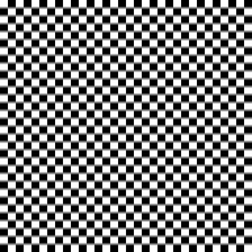
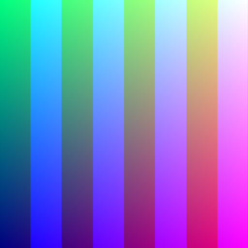
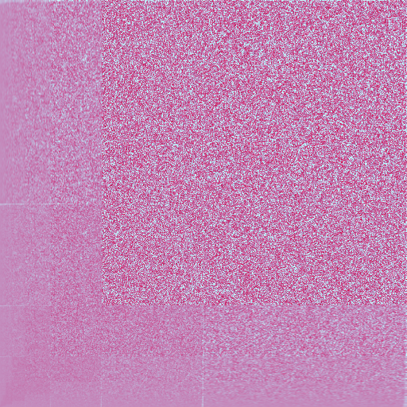
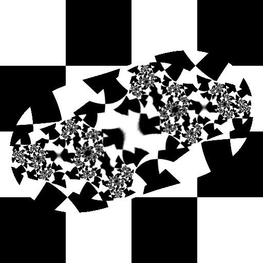
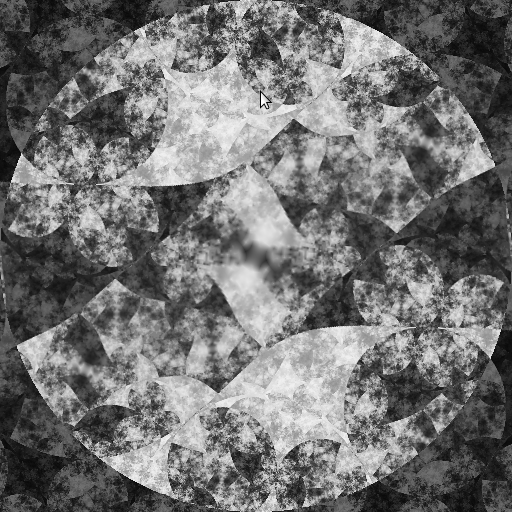
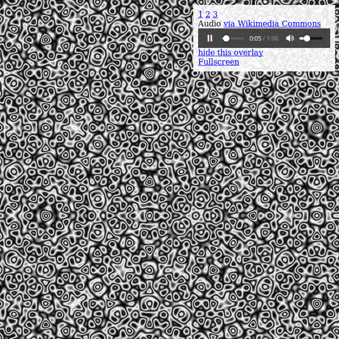
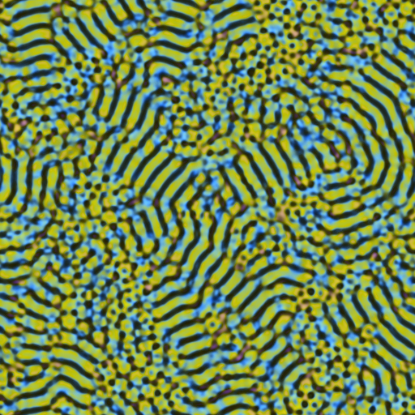
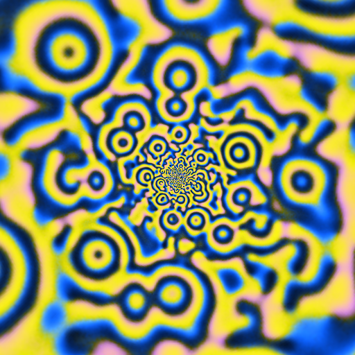
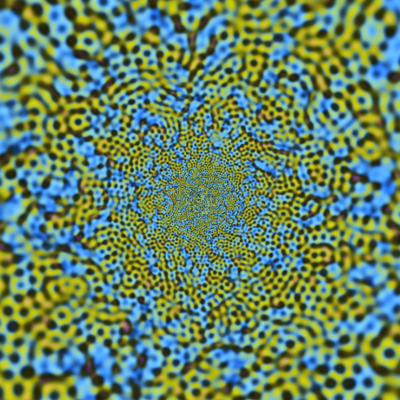

# webgpgpu

This library contains a series of walk-through examples, starting from "hello GPU" and slowly building up to simulating spatiotempoal PDEs/IDEs (e.g.
[pnmeila](https://www.chromeexperiments.com/experiment/gray-scott-simulation),
[woitzel](http://webglplayground.net/gallery),
[houston](https://bl.ocks.org/robinhouston/ed597847175cf692ecce),
[inear](http://www.inear.se/patterns/demo1/)).
The aim is to construct minimal examples using only HTML, Javascript and WebGL (no libraries). 
Previews and descriptions of the examples can be found [here](https://michaelerule.github.io/webgpgpu/examples/example_previews/index.html), and the files contained in this repository can be browsed on [Github pages](https://michaelerule.github.io/webgpgpu/).
Other examples of using WebGL for GPGPU code can be found here ([1](https://github.com/holgerl/webgl-gpgpu)
[2](https://github.com/stormcolor/webclgl)
[3](http://www.vizitsolutions.com/portfolio/webgl/gpgpu/)
[4](http://concord-consortium.github.io/lab/experiments/webgl-gpgpu/webgl.html)
[5](http://pathgl.com/documentation/gpgpu.html)).

# Basic examples

Basic examples that set up a two-dimensional rendering environment within the 3D WebGL framework, and then illustrate
basic rendering techniques like rendering from a texture, pixel operations like blurring, and random noise.
<table>
<tr><td width='120'></td>
<td><a href="./examples/Example_1_hello_gpu.html"><h4>Example 1: "Hello GPU"</h4></a>
(<a href="http://michaelerule.github.io/webgpgpu/examples/Example_1_hello_gpu.html">view example</a>)
<break/>
Set up an HTML Canvas for webGLM rendering, and render a simple coordinate-dependent image.
</td></tr>
<tr><td></td>
<td><a href="./examples/Example_2_colormap_texture.html"><h4>Example 2: "1D texture"</h4></a>
(<a href="http://michaelerule.github.io/webgpgpu/examples/Example_2_colormap_texture.html">view example</a>)
<break/>
Use a one-dimensional texture as a colormap. 
Eventually, we will also render to texture to store rendering and simulation data between frames.
</td></tr>
<tr><td></td>
<td><a href="./examples/Example_3_use_two_textures.html"><h4>Example 3: "Use two textures"</h4></a>
(<a href="http://michaelerule.github.io/webgpgpu/examples/Example_3_use_two_textures.html">view example</a>)
<break/>
Basic example loading two different colormaps as textures. 
Using multiple textures is important for rendering more complex systems, which may require more state than a single
red-green-blue texture can store.
</td></tr>
<tr><td></td>
<td><a href="./examples/Example_4_basic_blur.html"><h4>Example 4: "Pixel blur"</h4></a>
(<a href="http://michaelerule.github.io/webgpgpu/examples/Example_4_basic_blur.html">view example</a>)
<break/>
Simple vertical blur by averaging nearyby pixel values.
an image. 
</td></tr>
<tr><td></td>
<td><a href="./examples/Example_5_gaussian_blur_separable.html"><h4>Example 5: "Separable Gaussian blur"</h4></a>
(<a href="http://michaelerule.github.io/webgpgpu/examples/Example_5_gaussian_blur_separable.html">view example</a>)
<break/>
We can compute larger Gaussian blurs quickly by blurring first horizontally and vertically. 
</td></tr>
<tr><td></td>
<td><a href="./examples/Example_6_multi_blur.html"><h4>Example 6: "Multi-color blur"</h4></a>
(<a href="http://michaelerule.github.io/webgpgpu/examples/Example_6_multi_blur.html">view example</a>)
<break/>
For simulations, different colors might represent different quantities. This Gaussian blur kernel treats each
color channel separately, blurring them by different amounts.
</td></tr>
<tr><td></td>
<td><a href="./examples/Example_7_pseudorandom_noise.html"><h4>Example 7: "Noise"</h4></a>
(<a href="http://michaelerule.github.io/webgpgpu/examples/Example_7_pseudorandom_noise.html">view example</a>)
<break/>
Stochastic simulations and animations require a source of noise. This kernel approximates uniform pseudorandom number
generation, in a fast ad-hoc way that is suitable for visualizations (not not guaranteed to be random enough for other
uses).
</td></tr>
<tr><td></td>
<td><a href="./examples/Example_8_spatiotemporal_noise.html"><h4>Example 8: "Spatiotemporal noise"</h4></a>
(<a href="http://michaelerule.github.io/webgpgpu/examples/Example_8_spatiotemporal_noise.html">view example</a>)
<break/>
This example combines driving noise with repeated Gaussian blurs to create a spatiotemporal noise effect. 
</td></tr>
<tr><td></td>
<td><a href="./examples/Example_11_bitops.html"><h4>Example 11: "Bitops"</h4></a>
(<a href="http://michaelerule.github.io/webgpgpu/examples/Example_11_bitops.html">view example</a>)
<break/>
The minimal subset of WebGL doesn't explicitly support storing/reading unsigned integer types from textures, or bit operations. However, most reasonable hardware and WebGL implementations should implicitly store color texture data as 8-bit integers. This kernel accesses this color data as if it were uint8, even though it is technically a float. 
</td></tr>
</table>

# Image processing examples
These examples demonstrate basic image processing: color adjustments and blur/sharpen.
<table>
<tr><td width='120'></td>
<td><a href="./examples/Example_15_load_image.html"><h4>Example 15: "Load image"</h4></a>
(<a href="http://michaelerule.github.io/webgpgpu/examples/Example_15_load_image.html">view example</a>)
<break/>
This example loads an image resource, copies it to a texture, and displays it on screen.
</td></tr>
<tr><td></td>
<td><a href="./examples/Example_16_hue_rotation.html"><h4>Example 16: "Linear hue rotation"</h4></a>
(<a href="http://michaelerule.github.io/webgpgpu/examples/Example_16_hue_rotation.html">view example</a>)
<break/>
This example demonstrates hue rotation as an optimize linear transformation using hue and chroma.
</td></tr>
<tr><td></td>
<td><a href="./examples/Example_17_blur_image.html"><h4>Example 17: "Image blur"</h4></a>
(<a href="http://michaelerule.github.io/webgpgpu/examples/Example_17_blur_image.html">view example</a>)
<break/>
Apply iterated Guassian blur to image data.
</td></tr>
<tr><td></td>
<td><a href="./examples/Example_17_unsharp_mask.html"><h4>Example 17b: "Unsharp mask"</h4></a>
(<a href="http://michaelerule.github.io/webgpgpu/examples/Example_17_unsharp_mask.html">view example</a>)
<break/>
Apply iterated unsharp mask to image data.
</td></tr>
<tr><td></td>
<td><a href="./examples/Example_19_contrast_and_brightness.html"><h4>Example 19: "Brightness and contrast"</h4></a>
(<a href="http://michaelerule.github.io/webgpgpu/examples/Example_19_contrast_and_brightness.html">view example</a>)
<break/>
Adjust brightness and contrast of image based on mouse location.
</td></tr>
<tr><td></td>
<td><a href="./examples/Example_20_color_matrix_hue_and_saturation.html"><h4>Example 19: "Hue and saturation"</h4></a>
(<a href="http://michaelerule.github.io/webgpgpu/examples/Example_20_color_matrix_hue_and_saturation.html">view example</a>)
<break/>
Adjust hue and saturation of image based on mouse location.
</td></tr>
</table>

# Technical experiments
These examples test a couple of technical tricks that might be useful in rendering. 
<table>
<tr><td width='120'></td>
<td><a href="./examples/Example_25_gaussian_noise.html"><h4>Example 25: "Gaussian noise"</h4></a>
(<a href="http://michaelerule.github.io/webgpgpu/examples/Example_25_gaussian_noise.html">view example</a>)
<break/>
Convert uniform random numbers to Gaussian random numbers with mean and variance specified by the mouse location. 
</td></tr>
<tr><td></td>
<td><a href="./examples/Example_21_incremental_mipmaps.html"><h4>Example 21: "Recursive mipmaps"</h4></a>
(<a href="http://michaelerule.github.io/webgpgpu/examples/Example_21_incremental_mipmaps.html">view example</a>)
<break/>
Mipmaps are successively downsampled copies of a texture that are used to avoid aliasing. The are usually computed once, with a program is initialized. However, if we are rendering to texture data, and then want to use that data as a texture to color 3D objected, we may want to updates mipmaps. Rather than update all texture resolutions at once, however, we successively downsample on each iteration. meaning that lower-resolution mipmaps are updated later.
</td></tr>
<tr><td></td>
<td><a href="./examples/Example_26_statistical_mipmap.html"><h4>Example 25: "Statistical mipmaps"</h4></a>
(<a href="http://michaelerule.github.io/webgpgpu/examples/Example_26_statistical_mipmap.html">view example</a>)
<break/>
Texture mipmaps compute the average texture color over a region, by downsampling. What if we'd like the average statistics, like mean and variance, over a given region? 
</td></tr><tr><td></td>
<td><a href="./examples/Example_23_hello_particles.html"><h4>Example 25: "Hello particles"</h4></a>
(<a href="http://michaelerule.github.io/webgpgpu/examples/Example_23_hello_particles.html">view example</a>)
<break/>
Particle systems are useful in many-body simulations. This example uses texture data for particle location, and also renders each particle differently based on an offset into a texture.
</td></tr>
<tr><td></td>
<td><a href="./examples/Example_13_mouse_tracking.html"><h4>Example 13: "Julia set"</h4></a>
(<a href="http://michaelerule.github.io/webgpgpu/examples/Example_13_mouse_tracking.html">view example</a>)
<break/>
Track the mouse location and render a Julia set using video feedback. 
</td></tr>
</table>

# Psychedelic
These examples are "Just for fun"
<table>
<tr><td width='120'></td>
<td><a href="./examples/Example_9_quadratic_feedback.html"><h4>Example 9: "Quadratic feedback"</h4></a>
(<a href="http://michaelerule.github.io/webgpgpu/examples/Example_9_quadratic_feedback.html">view example</a>)
<break/>
Quadratic video feedback example of iterated conformal maps which can be used to render Julia set fractals. 
</td></tr>
<tr><td></td>
<td><a href="./examples/Example_10_logarithmic_feedback.html"><h4>Example 10: "Logarithmic feedback"</h4></a>
(<a href="http://michaelerule.github.io/webgpgpu/examples/Example_10_logarithmic_feedback.html">view example</a>)
<break/>
Iterated logarithmic video feedback. The logarithmic map can be used to approximate the coordinate mapping from visual cortex to retinal (or "subjective") coordinates, which explains why some visual hallucinations take on a tunnel appearance. <i>(Ermentrout GB, Cowan JD. A mathematical theory of visual hallucination patterns. Biological cybernetics. 1979 Oct 1;34(3):137-50.)</i>
</td></tr>
<tr><td></td>
<td><a href="./examples/Example_18_psychedelic_mask.html"><h4>Example 18: "Psychedelic filter"</h4></a>
(<a href="http://michaelerule.github.io/webgpgpu/examples/Example_18_psychedelic_mask.html">view example</a>)
<break/>
Applies a combination of blues, sharpening, and hue rotations for a psychedelic image effect.
</td></tr>
<tr><td></td>
<td><a href="./examples/Example_14_complex_arithmetic.html"><h4>Example 14: "Complex arithmetic"</h4></a>
(<a href="http://michaelerule.github.io/webgpgpu/examples/Example_14_complex_arithmetic.html">view example</a>)
<break/>
Interpret length-2 vectors as complex numbers using a collection of macros. More sophisticated video feedback example. 
</td></tr>
<tr><td></td>
<td><a href="./examples/Example_27_quasizoom.html"><h4>Example 17: "Quasicrystal 1"</h4></a>
(<a href="http://michaelerule.github.io/webgpgpu/examples/Example_27_quasizoom.html">view example</a>)
<break/>
An infinitely-zooming quasicrystal visualization with Shepard tone accompaniment, black and white.
</td></tr>
<tr><td></td>
<td><a href="./examples/Example_28_quasizoom_color.html"><h4>Example 17: "Quasicrystal 2"</h4></a>
(<a href="http://michaelerule.github.io/webgpgpu/examples/Example_28_quasizoom_color.html">view example</a>)
<break/>
An infinitely-zooming quasicrystal visualization with Shepard tone accompaniment, color.
</td></tr>
</table>

# Neural field simulations
Using only 8-bit color data to store state values means that these neural field simulations are only approximate. Some dynamical behaviors won't appear at parameters quite qhere the theory predicts. However, most qualitative behaviors are preserved.
<table>
<tr><td width='120'></td>
<td><a href="./examples/wilson_cowan_examples/WC_Example_1_basic.html"><h4>Example 1: "Wilson-Cowan equations"</h4></a>
(<a href="http://michaelerule.github.io/webgpgpu/examples/WC_Example_1_basic.html">view example</a>)
<break/>
Spiral wave emerge in a Wilson-Cowan neural field model. The lack of platform-specified rounding in WebGL means that these patteerns to not appear correcrtly on all devices (see example 2). 
</td></tr>
<tr><td></td>
<td><a href="./examples/wilson_cowan_examples/WC_Example_2_platform_independent_rounding.html"><h4>Example 2: "Platform independent rounding"</h4></a>
(<a href="http://michaelerule.github.io/webgpgpu/examples/wilson_cowan_examples/WC_Example_2_platform_independent_rounding.html">view example</a>)
<break/>
Spiral wave emerge in a Wilson-Cowan neural field model. Additional macros enforce a platform-independent rounding rule, allowing for consistent behavior across devices.
</td></tr>
<tr><td></td>
<td><a href="./examples/wilson_cowan_examples/WC_Example_3_wilson_cowan_center_surround.html"><h4>Example 3: "Center-surround"</h4></a>
(<a href="http://michaelerule.github.io/webgpgpu/examples/WC_Example_3_wilson_cowan_center_surround.html">view example</a>)
<break/>
Center surround "mexican hat" style coupling leads to the emergence of striped patterns in a Wilson-Cowan system.
</td></tr>
<tr><td></td>
<td><a href="./examples/wilson_cowan_examples/WC_Example_4_periodic_forcing.html"><h4>Example 4: "Flicker"</h4></a>
(<a href="http://michaelerule.github.io/webgpgpu/examples/wilson_cowan_examples/WC_Example_4_periodic_forcing.html">view example</a>)
<break/>
Turing patterns induced in a Wilson-Cowan system by periodic forcing. 
<i>(Rule M, Stoffregen M, Ermentrout B. <a href="https://journals.plos.org/ploscompbiol/article?id=10.1371/journal.pcbi.1002158">A model for the origin and properties of flicker-induced geometric phosphenes.</a> PLoS computational biology. 2011 Sep 29;7(9):e1002158.)</i>
</td></tr>
<tr><td></td>
<td><a href="./examples/wilson_cowan_examples/WC_Example_5_logarithmic_retinal_map.html"><h4>Example 5: "Retinotopic map"</h4></a>
(<a href="http://michaelerule.github.io/webgpgpu/examples/wilson_cowan_examples/WC_Example_5_logarithmic_retinal_map.html">view example</a>)
<break/>
Use the logarithmic map to approximate how a Wilson-Cowan pattern forming system might appear in subjective coordinates, if the emergent waves were to occur in visual cortex. <i>(Ermentrout GB, Cowan JD. <a href="https://link.springer.com/article/10.1007/BF00336965">A mathematical theory of visual hallucination patterns.</a> Biological cybernetics. 1979 Oct 1;34(3):137-50.)</i>
</td></tr>
<tr><td></td>
<td><a href="./examples/wilson_cowan_examples/WC_Example_9_wilson_cowan_fix_point_16_bit.html"><h4>Example 9: "16-bit precision"</h4></a>
(<a href="http://michaelerule.github.io/webgpgpu/examples/wilson_cowan_examples/WC_Example_9_wilson_cowan_fix_point_16_bit.html">view example</a>)
<break/>
Use two color components, with 8-bits each, to implement 16-bit fixed-point storage of simulation states. This leads to a slightly more accurate numerical integration.
</td></tr>
<tr><td></td>
<td><a href="./examples/wilson_cowan_examples/WC_Example_10_fullscreen.html"><h4>Example 10: "Fullscreen"</h4></a>
(<a href="http://michaelerule.github.io/webgpgpu/examples/wilson_cowan_examples/WC_Example_10_fullscreen.html">view example</a>)
<break/>
Full-screen test of a logarithmically-mapped Wilson-Cowan pattern forming system.
</td></tr>
<tr><td></td>
<td><a href="./examples/wilson_cowan_examples/WC_Example_11_acid_trip.html"><h4>Example 11: "Psychedelic"</h4></a>
(<a href="http://michaelerule.github.io/webgpgpu/examples/wilson_cowan_examples/WC_Example_11_acid_trip.html">view example</a>)
<break/>
Full-screen test of a logarithmically-mapped Wilson-Cowan pattern forming system. Additional noise and hue rotation effects are added. This is purely a visual demonstration.
</td></tr>
</table>

#  "Games"
Not actually games, but rather explorations of using a tile shader with various cellular automata. The first few examples just set up basic [(1) html](https://michaelerule.github.io/webgpgpu/games/lesson_1_hello_html.html), render a [(2) test canvas](https://michaelerule.github.io/webgpgpu/games/lesson_2_hello_canvas.html), and then check that things are [(3) working](https://michaelerule.github.io/webgpgpu/games/lesson_3_gpgpu_library.html) with the webgpgpu javascript library. The next few examples check that we've configured the [(4) viewport](https://michaelerule.github.io/webgpgpu/games/lesson_4_hello_viewport.html) correctly, and build up [(5) mouse](https://michaelerule.github.io/webgpgpu/games/lesson_5_mouse_panning.html) and [(6) keyboard](https://michaelerule.github.io/webgpgpu/games/lesson_6_keyboard_panning.html) interaction.
<table>
  
<tr><td width='120'></td>
<td><a href="https://github.com/michaelerule/webgpgpu/blob/master/games/lesson_7_hello_texture.html"><h4>Game Example 7: "Hello Texture"</h4></a>
(<a href="https://michaelerule.github.io/webgpgpu/games/lesson_7_hello_texture.html">view example</a>)
<break/>
Load a texture of 256 8×8 tiles from a web resource. We'll use this texture to render pixels of the game not as colors, but as character-like tiles. Mouse and keyboard zoom/pan should work.
</td></tr>
  
<tr><td width='120'></td>
<td><a href="https://github.com/michaelerule/webgpgpu/blob/master/games/lesson_8_base64_texture.html"><h4>Game Example 8: "Base64 Texture"</h4></a>
(<a href="https://michaelerule.github.io/webgpgpu/games/lesson_8_base64_texture.html">view example</a>)
<break/>
Encode texture in javascript source in base64. This side-steps the cross-domain restrictions and makes it slightly less painful to edit the texture locally when developing. Mouse panning and zoom should work.
</td></tr>
  
<tr><td width='120'></td>
<td><a href="https://github.com/michaelerule/webgpgpu/blob/master/games/lesson_9_hello_tiles.html"><h4>Game Example 9: "Hello Tiles"</h4></a>
(<a href="https://michaelerule.github.io/webgpgpu/games/lesson_9_hello_tiles.html">view example</a>)
<break/>
Get a tile shader working that renders 8x8 tiles at a large size to the screen, with 1:1 matching of canvas to device pixels. 
</td></tr>

<tr><td width='120'></td>
<td><a href="https://github.com/michaelerule/webgpgpu/blob/master/games/lesson_10_hello_noise.html"><h4>Game Example 10: "Hello Noise"</h4></a>
(<a href="https://michaelerule.github.io/webgpgpu/games/lesson_10_hello_noise.html">view example</a>)
<break/>
Tests random number generation and renders noisy pixels as randomly selected tiles from a texture of 256 8x8 pixel tiles.
</td></tr>
  
<tr><td width='120'></td>
<td><a href="https://github.com/michaelerule/webgpgpu/blob/master/games/lesson_11_game_of_life.html"><h4>Game Example 11: "Game of Life"</h4></a>
(<a href="https://michaelerule.github.io/webgpgpu/games/lesson_11_game_of_life.html">view example</a>)
<break/>
Conway's game-of-life with a wacky tile shader. Dying cells are skulls. Colors diffuse outward from living areas.
</td></tr>

</table>

Unless otherwise specified, media, text, and rendered outputs are licensed under the [Creative Commons Attribution Share Alike 4.0 license](https://choosealicense.com/licenses/cc-by-sa-4.0/) (CC BY-SA 4.0). Source code is licensed under the [GNU General Public License version 3.0](https://www.gnu.org/copyleft/gpl.html) (GPLv3). The CC BY-SA 4.0 is [one-way compatible](https://creativecommons.org/compatiblelicenses) with the GPLv3 license. 

